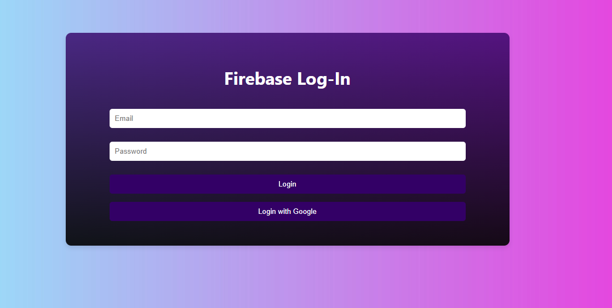

Entendi, você deseja um README para este repositório específico. Vamos criar um! Aqui está:

---

# Login com React e Firebase

Este é um simples projeto de login desenvolvido com React e Firebase.



## Funcionalidades

- Autenticação de usuário utilizando o Firebase Authentication.
- Interface simples e responsiva construída com React.

## Como usar

1. Clone este repositório:

   ```bash
   git clone https://github.com/luizvictorino/login-react-firebase.git
   ```

2. Instale as dependências:

   ```bash
   cd login-react-firebase
   npm install
   ```

3. Configure seu projeto no Firebase:
   - Crie um projeto no [Firebase Console](https://console.firebase.google.com/).
   - Adicione um aplicativo da web ao seu projeto Firebase e copie as credenciais.
   - No arquivo `src/firebase/config.js`, substitua as configurações do Firebase pelas suas próprias.

4. Inicie o servidor de desenvolvimento:

   ```bash
   npm start
   ```

5. Abra [http://localhost:3000](http://localhost:3000) no seu navegador para visualizar o aplicativo.

## Contribuindo

Contribuições são bem-vindas! Sinta-se à vontade para abrir problemas e enviar solicitações de pull.

## Licença

Este projeto está licenciado sob a [Licença MIT](LICENSE).

---

Certifique-se de que a imagem de exemplo (login_screenshot.png) esteja no diretório raiz do projeto para que ela seja exibida no README.

Se precisar de mais alguma coisa, estou aqui para ajudar!
